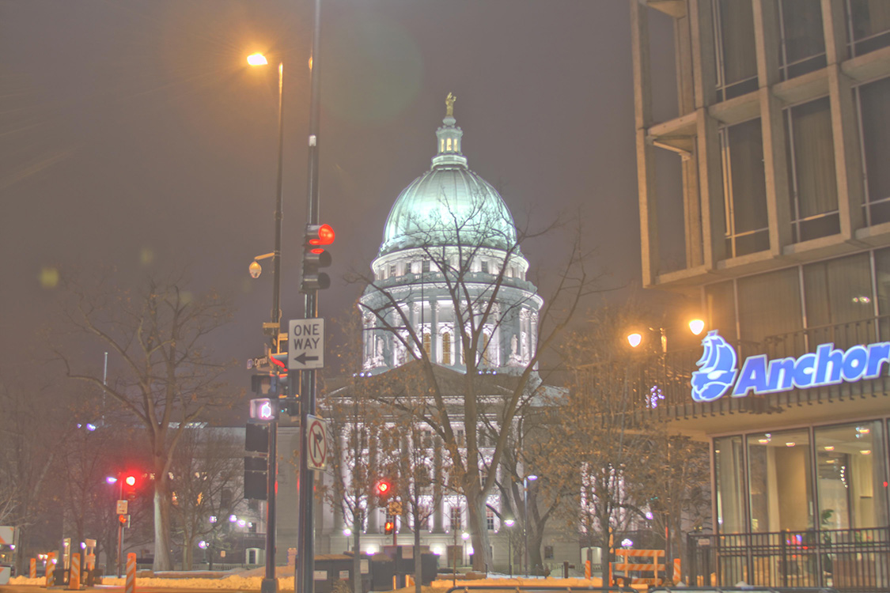
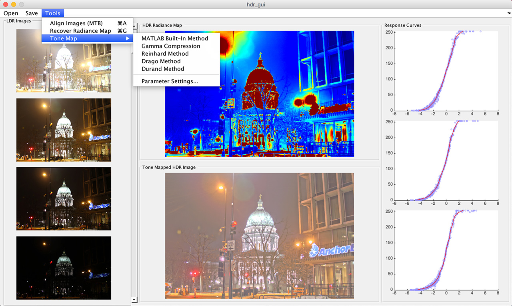
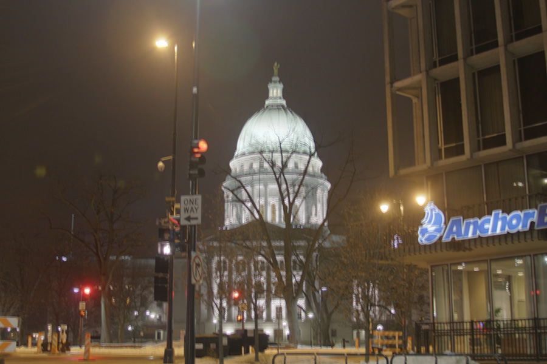
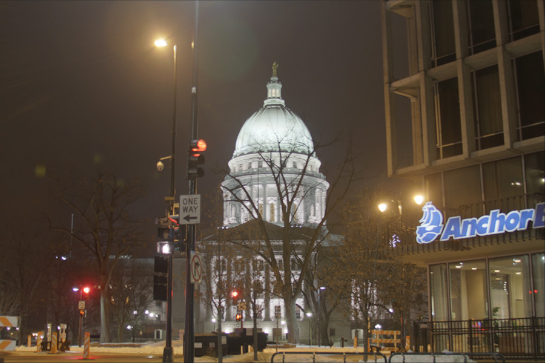
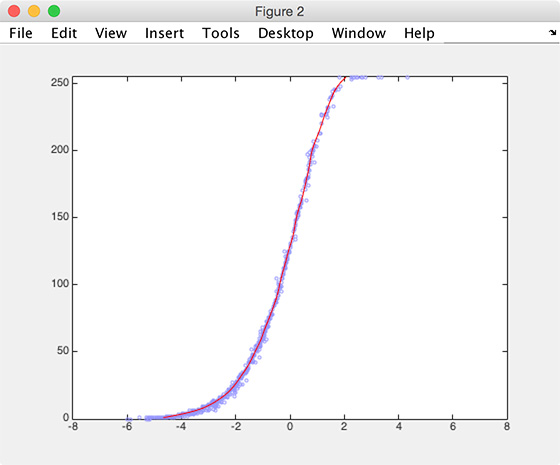
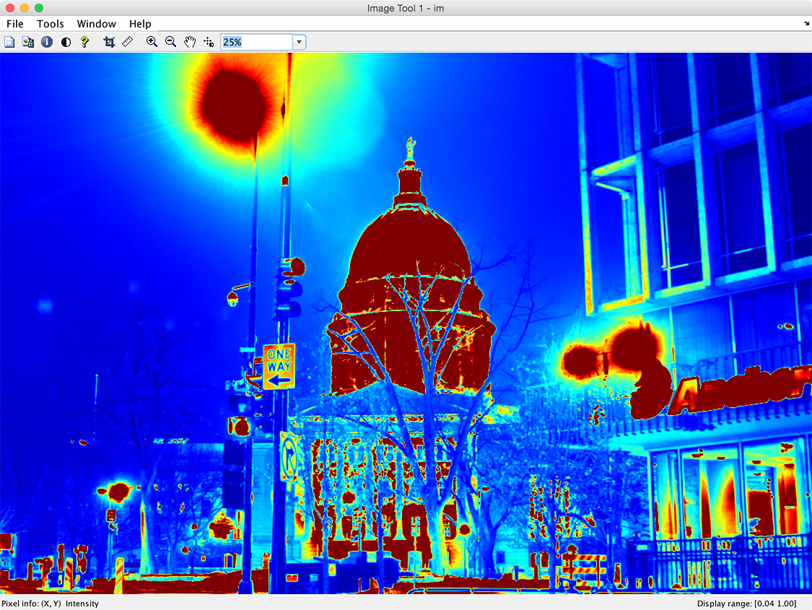
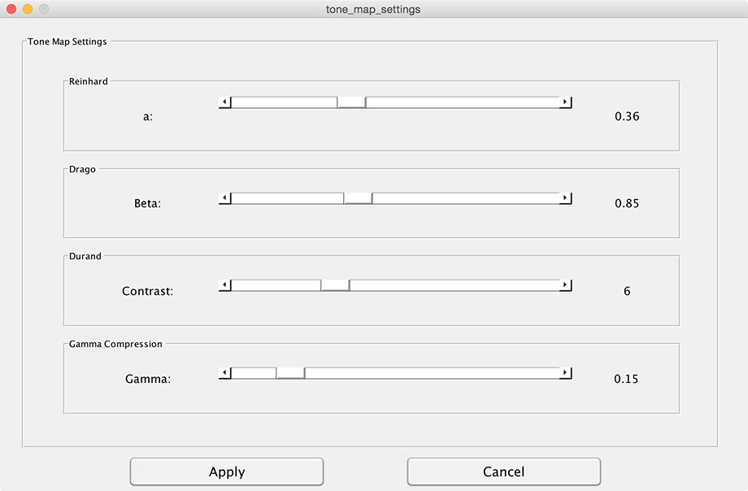
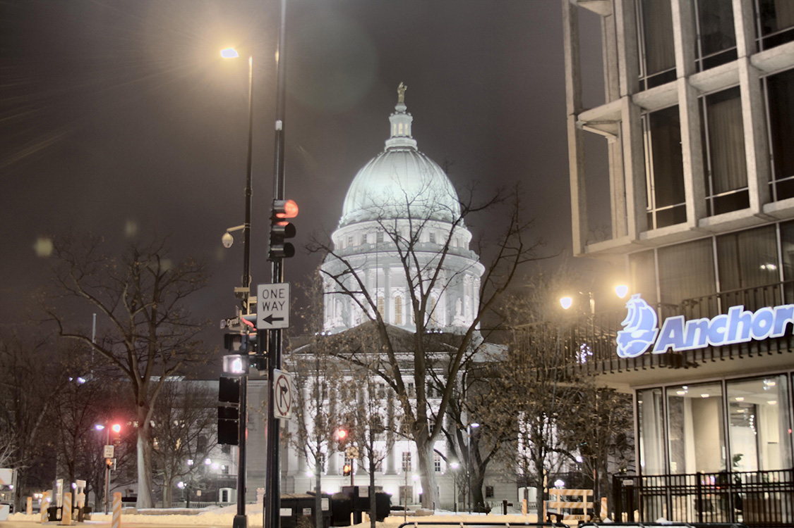
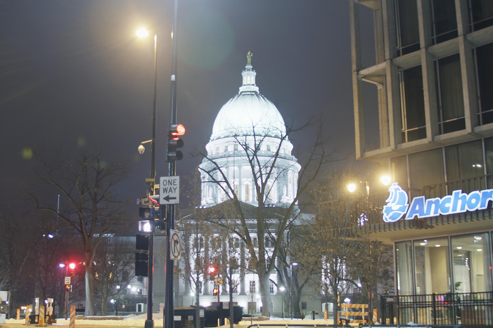
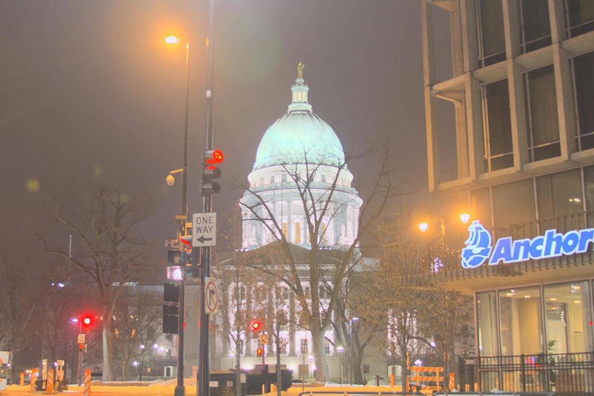

% CS 766 - HDR Project Documentation
% Ke Ma; Christopher Bodden
% 2/19/2015

# Project Overview

## Links
* Repository: <https://github.com/cbod/cs766-hdr>
* Wiki: <https://github.com/cbod/cs766-hdr/wiki>

## Assignment Description
High dynamic range (HDR) images have much larger dynamic range than traditional images' 256 brightness levels. In addition, they correspond linearly to physical irradiance values of the scene. Hence, they have many applications in vision. In this project, we implement algorithms to assemble an HDR image from several low dynamic range images.

## Features
This is a brief description of our implementation. More details can be found in the other pages of the wiki.

### Basic Features
* Debevec's Method for HDR reconstruction
* Gamma Compression Tone Mapping Algorithm
* Reinhard's Tone Mapping Algorithm

### "Bonus" Features
* Ward's MTB Image Alignment Algorithm
* Drago's Tone Mapping Algorithm
* Durand's Tone Mapping Algorithm
* GUI to Pipeline the Image Recreation and Expose All Functions Implemented

# Results

## Image to be Vote: _Friday Night_
Our final image we call _Friday Night_ mainly because we took it on Friday evening. The image features an interesting scene that is great for HDR. The capitol building and street lights are very bright against the dark sky. They also wash out the finer details in the buildings. HDR allows us to preserve these features and present a striking scene.

## Reproducing Our Results

1. Load the LDR images: _FridayNight-x.jpg_
2. Select _FridayNight-ExpTime.txt_
3. Recover the response curve and radiance map
4. Tone map with Durand at contrast set to 6

The only post processing we did was down-sampling the final image because our original image was taken at 18 megapixels.

## Findings

We found that the best tone mapping algorithm that we implemented was Durand followed by Drago. Both of these produce dramatic, vivid colors. However, Durand tends to preserve more of the finer details. Reinhard, gamma compression, and the built-in MATLAB method all produce less interesting results. The built-in MATLAB method and gamma compression are washed out, while the Reinhard method produces less interesting colors.

# Using the GUI
To make working with our functions easier, we've implemented a simple GUI that streamlines the process and visually displays the results of image operations. Users can open a series of LDR images then align the images, recover the response functions, build the radiance map, and tone map to produce a final result. Or the users can directly open a .hdr file and tone map to produce a final result.

## Starting the GUI
Simply run the file _hdr_gui.m_

## Loading Images
We provide 2 methods to acquire the radiance map: 1) from a series of LDR images or 2) from a .hdr file

### Using a series of LDR Images
1. Select Open -> Load LDR Images.
2. A dialog will open for you to select all of the LDR images.
3. A second dialog will open to select the .txt file with image exposure times. (one exposure time per line, exposure time is represented as its reciprocal, e.g. 1/10s -> 10)
4. Click any of the loaded images to display the enlarged image in a new window.

### Using a .hdr Image
1. Select Open -> Open HDR Radiance Map.
2. A dialog will open for you to select the HDR image.

## Aligning Images
_This option is available after opening a series of LDR images successfully._

Simply select Tools -> Align Images (MTB).

This is an implementation of the method describe in:

Ward, G. (2003). [Fast, robust image registration for compositing high dynamic range photographs from hand-held exposures](http://pages.cs.wisc.edu/~lizhang/courses/cs766-2008f/projects/hdr/jgtpap2.pdf)

_Blended Images before Alignment_

_Blended Images after Alignment_

## Recovering the Response Curves and Producing a Radiance Map
_This option is available after opening a series of LDR images successfully._

Recovering the response curves and producing the radiance map are combined into a single operation. To perform this operation:

1. Select Tools -> Recover Radiance Map.
2. Click on either the displayed radiance map or any of the curves to enlarge the object in a new window.

This is an implementation of the method describe in:

Debevec, P. E., & Malik, J. (1997). [Recovering high dynamic range radiance maps from photographs](http://vsingh-www.cs.wisc.edu/cs766-12/lec/debevec-siggraph97.pdf)

_Response Curve_

_Radiance Map in False Color_

## Tone Mapping
_This option is available after recovering the radiance map from a series of LDR images successfully or opening a .hdr file._

We provide 5 tone mapping methods and parameter settings in the Tools -> Tone Map menu. The following explains each option:

### Picking Settings
This menu allows users to tune relevant tone mapping parameters for each specific algorithm. You must click 'Apply' to save the settings.

1. Select Tools -> Tone Map -> Parameter Settings.
2. Tune any parameter of interest.
3. Click 'Apply'.

### MATLAB Built-In Method
This simply uses the built-in MATLAB tonemap() method. This is provided mainly for reference.

### Gamma Compression
This is an implementation of a simple gamma compression.

### Reinhard Method
This is an implementation of the method describe in:

Reinhard, E., & Devlin, K. (2005). [Dynamic range reduction inspired by photoreceptor physiology](http://pages.cs.wisc.edu/~lizhang/courses/cs766-2012f/projects/hdr/Reinhard2005DRR.pdf)

### Drago Method
This is an implementation of the method describe in:

Drago, F., Myszkowski, K., Annen, T., & Chiba, N. (2003). [Adaptive logarithmic mapping for displaying high contrast scenes](http://pages.cs.wisc.edu/~lizhang/courses/cs766-2012f/projects/hdr/Drago2003ALM.pdf)

### Durand Method
This is an implementation of the method describe in:

Durand, F., & Dorsey, J. (2002). [Fast bilateral filtering for the display of high-dynamic-range images](http://pages.cs.wisc.edu/~lizhang/courses/cs766-2012f/projects/hdr/DurandBilateral.pdf)

## Saving Images
Using the Save menu, we offer two options for saving working: to save the radiance map as a .hdr file and to save the final tone mapped image.

### Saving HDR Radiance Map
_This option is available after recovering the radiance map from a series of LDR images successfully or opening a .hdr file._

1. Select Save -> Save HDR Radiance Map.
2. Select the .hdr file destination and name.
3. Click Save.

### Saving Tone Mapped HDR Image
_This option is available after tone mapping a radiance map._

1. Select Save -> Save Tone Mapped HDR Image.
2. Select the image destination and name.
3. Click Save.

# Function Descriptions
Below provide basic descriptions of our functions.

## hdr_gui.m
`function varargout = hdr_gui(varargin)`

This function launches the main GUI window. It is not meant to be called programatically! Please run this as the main script in MATLAB.

## loadImages.m
`function imgs = loadImages(imgFiles)`

Inputs:

* imgFiles: a vector of image filenames to load (1D cell array)

Outputs:

* imgs: the loaded color images (4D array, height x width x color x imageIndex)

## alignMTB.m
`function alignedImgs = alignMTB(imgs, offsetRange)`

Inputs:

* imgs: a vector of the original color images (4D array, height x width x color x imageIndex)
* offsetRange: allowable offset range (0-1)

Outputs:

* alignedImgs: a vector of the aligned color images (4D array, height x width x color x imageIndex)

## samplePxs.m
`function Z = samplePxs(imgs)`

Inputs:

* imgs: a vector of greyscale images (3D array, height x width x imageIndex)

Outputs:

* Z: a vector of randomly sampled pixels (2D array, pixelIndex x imageIndex)

## gSolve.m
`function [g,lE] = gSolve(Z,B,l,w)`

Inputs:

* Z: a vector of randomly sampled pixels (2D array, pixelIndex x imageIndex)
* B: a vector of natural log exposure time values
* l: smoothing parameter lambda
* w: a vector of weighting factors (hat function)

Outputs:

* g: the inverse of f function (response curve)
* lE: the sampled natural log exposure values

## mergeExps.m
`function E = mergeExps(Z,B,g,w)`

Inputs:

* Z: a vector of greyscale images (3D array, height x width x imageIndex)
* B: a vector of natural log exposure time values
* g: the inverse of f function (response curve)
* w: a vector of weighting factors (hat function)

Outputs:

* E: the recovered greyscale radiance map

## makeRadmap.m
`function [radmap, rG, gG, bG, rPxVals, gPxVals, bPxVals, rLgExps, gLgExps, bLgExps] = makeRadmap(imgs,expTimes,smoothness)`

Inputs:

* imgs: a vector of the original color images (4D array, height x width x color x imageIndex)
* expTimes: a vector of exposure times
* smoothness: smoothing parameter lambda

Outputs:

* radmap: the recovered color radiance map
* rG: the inverse of f function (response curve) for the red channel
* gG: the inverse of f function (response curve) for the green channel
* bG: the inverse of f function (response curve) for the blue channel
* rPxVals: the sampled pixel values for the red channel
* gPxVals: the sampled pixel values for the green channel
* bPxVals: the sampled pixel values for the blue channel
* rLgExps: the sampled natural log exposure values for the red channel
* gLgExps: the sampled natural log exposure values for the green channel
* bLgExps: the sampled natural log exposure values for the blue channel

## toneMapGamma.m
`function [image] = toneMapGamma(radMap, gamma)`

Inputs:

* radMap: a color radiance map
* gamma: gamma parameter (0-1)

Outputs:

* image: the tone mapped HDR image 

## toneMapBasic.m
`function [image] = toneMapBasic(radMap, a)`

Inputs:

* radMap: a color radiance map
* a: brightness parameter (0.09, 0.18, 0.36 or 0.72)

Outputs:

* image: the tone mapped HDR image 

## toneMapDrago.m
`function [image] = toneMapDrago(radMap, b)`

Inputs:

* radMap: a color radiance map
* b: bias parameter (0.7-1.0)

Outputs:

* image: the tone mapped HDR image 

## toneMapDurand.m
`function image = toneMapDurand(radmap, contrast)`

Inputs:

* radmap: a color radiance map
* contrast: base contrast parameter (around 5)

Outputs:

* image: the tone mapped HDR image 

## Other Files
Some other files that are not meant to be used functionally, but are either needed for the GUI or were used for testing.

### _enlargeImage.m_
This function is simply a helper to allow enlarging an image when clicked.

### _tone_map_settings.m_
Launches the tone map settings menu.

### _hdr_gui.fig_
The MATLAB figure for the main program GUI.

### _tone_map_settings.fig_
The MATLAB figure for the tone map settings menu.

### _TestScripts\\alignMTB_test.m_
A script we used to test the MTB alignment method.

### _TestScripts\\gSolve_test.m_
A script we used to test the solver method for recovering response curves.

### _TestScripts\\makeRadmap_test.m_
A script we used to test the radiance map creation method.

### _TestScripts\\mergeExps_test.m_
A script we used to test the exposure merging method.

### _TestScripts\\toneMap_test.m_
A script we used to test the various tone mapping methods.

# Credits
Below is a break-down of the work description. We worked together on taking the images and also helped fix some of each other's bugs!

## Ke Ma
* Random Pixel Sampler
* Response Curve Solution
* Radiance Map Creation
* MTB Alignment
* Durand Tone Mapping

## Christopher Bodden
* Reinhart Tone Mapping
* Drago Tone Mapping
* GUI
* Documentation Wiki

# References

1. Debevec, P. E., & Malik, J. (1997). [Recovering high dynamic range radiance maps from photographs](http://vsingh-www.cs.wisc.edu/cs766-12/lec/debevec-siggraph97.pdf)
2. Ward, G. (2003). [Fast, robust image registration for compositing high dynamic range photographs from hand-held exposures](http://pages.cs.wisc.edu/~lizhang/courses/cs766-2008f/projects/hdr/jgtpap2.pdf)
3. Reinhard, E., & Devlin, K. (2005). [Dynamic range reduction inspired by photoreceptor physiology](http://pages.cs.wisc.edu/~lizhang/courses/cs766-2012f/projects/hdr/Reinhard2005DRR.pdf)
4. Drago, F., Myszkowski, K., Annen, T., & Chiba, N. (2003). [Adaptive logarithmic mapping for displaying high contrast scenes](http://pages.cs.wisc.edu/~lizhang/courses/cs766-2012f/projects/hdr/Drago2003ALM.pdf)
5. Durand, F., & Dorsey, J. (2002). [Fast bilateral filtering for the display of high-dynamic-range images](http://pages.cs.wisc.edu/~lizhang/courses/cs766-2012f/projects/hdr/DurandBilateral.pdf)
6. Paris, S., & Durand, F. (2006). [A fast approximation of the bilateral filter using a signal processing approach](http://dspace.mit.edu/bitstream/handle/1721.1/34876/MIT-CSAIL-TR-2006-073.pdf?sequence=1)